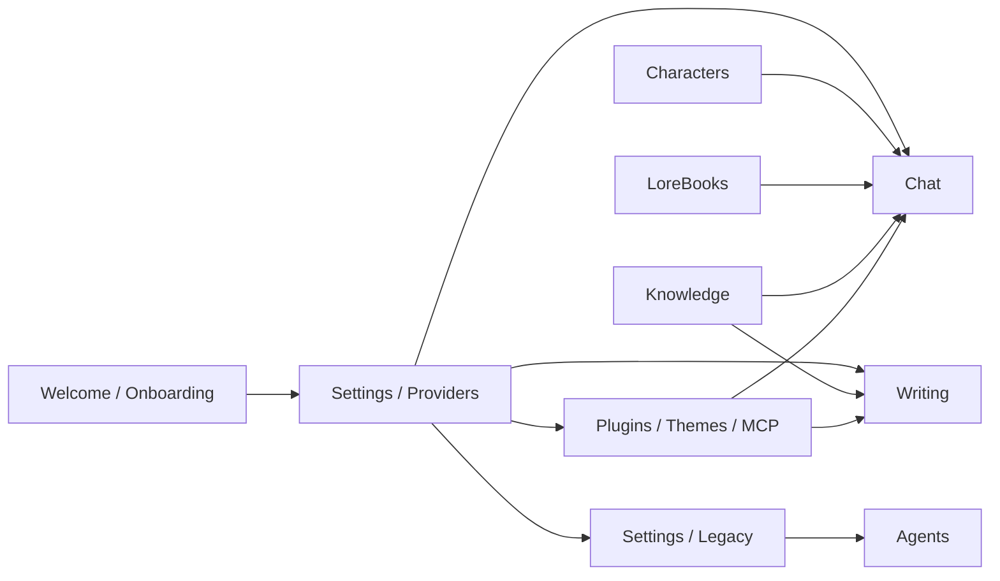

# Vellium User Guide

Vellium is a local-first desktop/workbench app for:

- AI chat and RP workflows
- long-form writing workflows
- characters and LoreBooks
- knowledge collections and RAG
- autonomous agent workflows over a selected workspace
- MCP / tool calling
- local plugins and themes

This guide documents the current UI and is based on the real app areas: `Welcome`, `Chat`, `Writing`, `Characters`, `LoreBooks`, `Knowledge`, `Settings`, and plugin-powered surfaces. The dedicated Agents workspace is deprecated and now lives under `Settings → Legacy`.

The screenshots in this guide are local captures from the current app build. Where it makes onboarding clearer, they use `Simple Mode` so the first-run flow matches what many users will actually see.

## Documentation Map

| File | What it covers |
| --- | --- |
| [getting-started.md](./getting-started.md) | First launch, provider presets, basic setup, and the shortest path to a working chat |
| [chat-and-rp.md](./chat-and-rp.md) | Chat, RP flows, character usage, inspector controls, RAG, TTS, translation, and multi-character scenes |
| [tool-calls-and-media.md](./tool-calls-and-media.md) | MCP tool calls, generated-image UI, structured media payloads, preview states, and troubleshooting |
| [characters-and-lorebooks.md](./characters-and-lorebooks.md) | Character cards, import/export, GUI vs raw JSON editing, LoreBooks, and world info |
| [writing.md](./writing.md) | Projects, chapters, scenes, Character Forge, summary lenses, DOCX / Markdown workflows |
| [knowledge-and-rag.md](./knowledge-and-rag.md) | Knowledge collections, ingestion, scope, and how RAG plugs into chat and writing |
| [settings-and-providers.md](./settings-and-providers.md) | Providers, models, UI settings, generation, context, security, plugins, and MCP |
| [plugins-and-security.md](./plugins-and-security.md) | Plugin management, permissions, Pluginfile, themes, and safe usage guidelines |
| [runtime-and-integration-reference.md](./runtime-and-integration-reference.md) | Headless mode, runtime flags, MCP lifecycle, and integration helper functions |
| [web-service-e2ee-and-regulatory-plan.md](./web-service-e2ee-and-regulatory-plan.md) | Future E2EE/BYOK web-service architecture, German/EU regulatory constraints, and implementation phases |
| [troubleshooting.md](./troubleshooting.md) | Common failures, diagnostics, and a practical fallback plan |

## How Vellium Fits Together

## Workspaces

| Area | Main job | Usually configured together with |
| --- | --- | --- |
| `Chat` | Dialogues, RP, tool calling, translation, TTS | `Characters`, `LoreBooks`, `Knowledge`, `Settings` |
| `Writing` | Books, chapters, scenes, drafts, summaries, lenses | `Characters`, `Knowledge`, `Settings` |
| `Characters` | Importing and editing character cards | `Chat`, `Writing` |
| `LoreBooks` | World facts, trigger keys, scripted prompt injections | `Chat` |
| `Knowledge` | Retrieval collections for RAG | `Chat`, `Writing`, `Settings` |
| `Settings` | Providers, models, UI, prompt stack, security, plugins, MCP | Everything |
| `Settings → Legacy` | Deprecated Agents and non-Simple UI compatibility | Existing agent threads and old workspace preferences |
| `Plugin tabs / widgets` | Plugin-powered extensions and extra UI surfaces | `Settings -> Plugins` |

## Recommended Learning Order

1. Finish the [quick start](./getting-started.md) and create your first working provider profile.
2. In `Settings`, choose an active chat model.
3. Open `Chat` and send a simple message without a character first.
4. Add or import a character in `Characters`.
5. If your workflow needs world facts, create a LoreBook.
6. If your workflow needs retrieval, create a knowledge collection in `Knowledge`.
7. Use Chat, Writing, or plugin-powered surfaces for primary workflows; deprecated Agents remains available under `Settings → Legacy`.
8. Only after that move on to multi-character scenes, writer workflows, plugins, and MCP.

## Important Things to Know Up Front

- Vellium is not tied to a single backend. Chat, translation, compression, TTS, and RAG can all use different models.
- `Local-only mode` limits the app to localhost or private-network endpoints.
- Tool calling through MCP only works with OpenAI-compatible chat/completions providers, not with KoboldCpp.
- Legacy Agents data, server APIs, and workspace remain available through `Settings → Legacy`.
- `Knowledge` and `LoreBooks` solve different problems: one is retrieval-based, the other is trigger-based scripted context.
- Plugins in Vellium are local extensions. Treat their permissions the same way you would treat shell tools or third-party scripts.

## Screenshot Notes

- `Welcome`, `Chat`, and `Writing` screenshots in this guide use `Simple Mode`, because that is the cleaner default for first-time onboarding.
- `Knowledge` and `Settings` screenshots use the standard workspace layout, since those sections are not meaningfully simplified in the same way.

