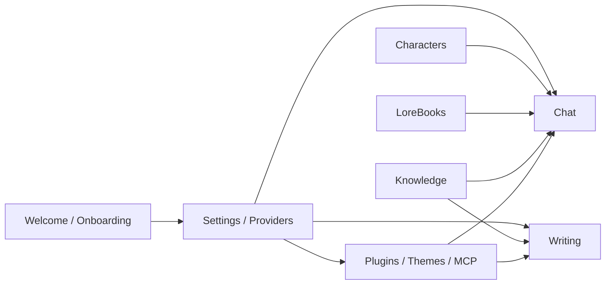

# Руководство по использованию Vellium

Vellium - это локально-ориентированное desktop/workbench-приложение для:

- AI-чата и RP-сценариев
- писательских workflow
- персонажей и лорбуков
- баз знаний и RAG
- MCP/tool calling
- локальных плагинов и тем

Это руководство описывает текущее поведение интерфейса и опирается на реальные разделы приложения: `Welcome`, `Chat`, `Writing`, `Characters`, `LoreBooks`, `Knowledge`, `Settings` и plugin tabs.

## Карта документации

| Файл | О чем раздел |
| --- | --- |
| [getting-started.md](./getting-started.md) | Первый запуск, пресеты провайдеров, базовая настройка и быстрый старт |
| [chat-and-rp.md](./chat-and-rp.md) | Чат, RP, персонажи в чате, Inspector, RAG, TTS, перевод и multi-character режим |
| [characters-and-lorebooks.md](./characters-and-lorebooks.md) | Создание и импорт персонажей, JSON/GUI редактор, лорбуки и world info |
| [writing.md](./writing.md) | Проекты, главы, сцены, Character Forge, summary lenses, DOCX/Markdown |
| [knowledge-and-rag.md](./knowledge-and-rag.md) | Коллекции знаний, ingestion, scope и подключение RAG к chat/writing |
| [settings-and-providers.md](./settings-and-providers.md) | Провайдеры, модели, интерфейс, генерация, контекст, security, MCP |
| [plugins-and-security.md](./plugins-and-security.md) | Работа с плагинами, Pluginfile, permissions, themes и безопасное использование |
| [troubleshooting.md](./troubleshooting.md) | Частые проблемы, диагностика и восстановление |

## Как устроен Vellium

## Рабочие области

| Раздел | Основная задача | Что обычно настраивают рядом |
| --- | --- | --- |
| `Chat` | Диалоги, RP, tool calling, перевод, TTS | `Characters`, `LoreBooks`, `Knowledge`, `Settings` |
| `Writing` | Книги, главы, сцены, черновики, summary lenses | `Characters`, `Knowledge`, `Settings` |
| `Characters` | Импорт и редактирование character cards | `Chat`, `Writing` |
| `LoreBooks` | Факты мира, ключи и инъекции контекста | `Chat` |
| `Knowledge` | Базы знаний для retrieval | `Chat`, `Writing`, `Settings` |
| `Settings` | Провайдеры, модели, UI, prompt stack, security, plugins, MCP | Все разделы |
| `Plugin tabs` | Расширения, которые добавляют собственные вкладки | `Settings -> Plugins` |

## Рекомендуемая последовательность освоения

1. Пройти [быстрый старт](./getting-started.md) и создать первый рабочий provider profile.
2. В `Settings` выбрать активную модель для chat.
3. Создать простой чат без персонажа, чтобы проверить, что генерация работает.
4. Добавить или импортировать персонажа в `Characters`.
5. При необходимости создать лорбук для мира и коллекцию знаний для RAG.
6. Только после этого переходить к multi-character сценам, writer workflow, plugin tabs и MCP.

## Что важно знать заранее

- Vellium не привязан к одному backend'у: модели для чата, перевода, компрессии, TTS и RAG могут отличаться.
- `Local-only mode` ограничивает работу локальными или приватными endpoint'ами.
- Tool calling через MCP работает только с OpenAI-compatible chat/completions провайдерами, а не с KoboldCpp.
- `Knowledge` отвечает за retrieval-коллекции, а `LoreBooks` отвечают за scripted/world-info контекст. Это разные механики.
- Плагины в Vellium локальные. Их права надо проверять так же внимательно, как shell-утилиты или сторонние скрипты.

## Скриншоты

Ниже использован текущий UI-скрин из материалов репозитория:

Если вы используете собственную сборку, точные цвета, тема или набор plugin tabs могут отличаться, но структура рабочих областей останется той же.
